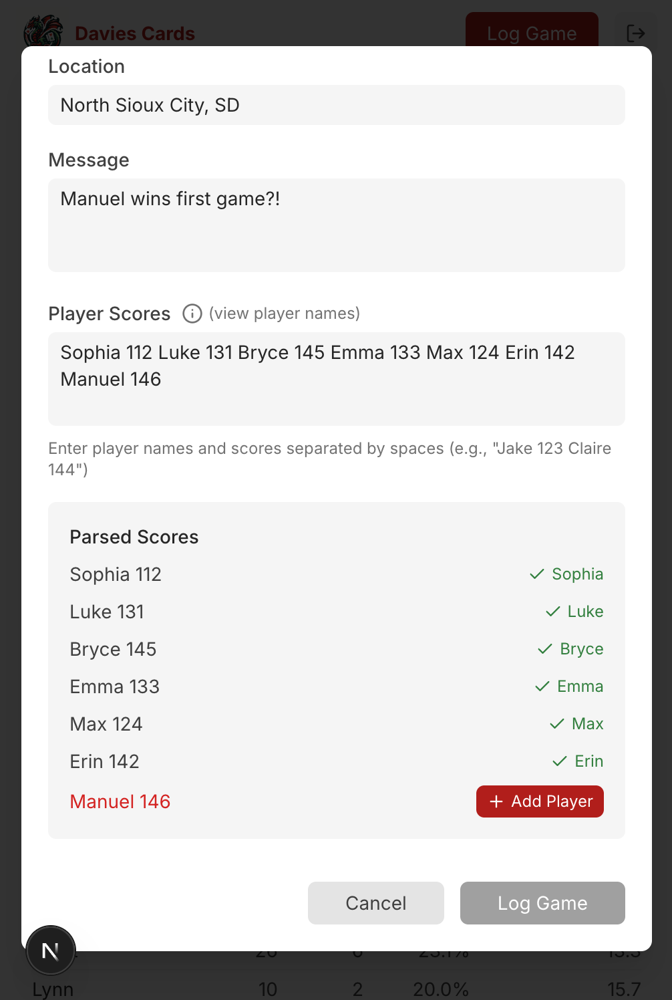
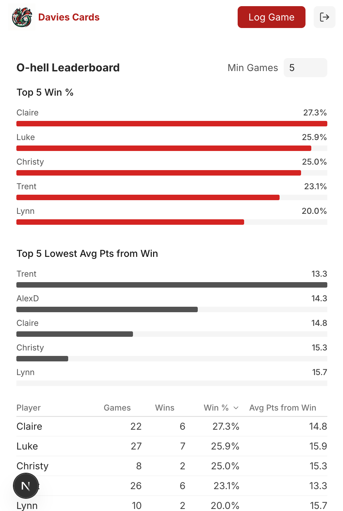
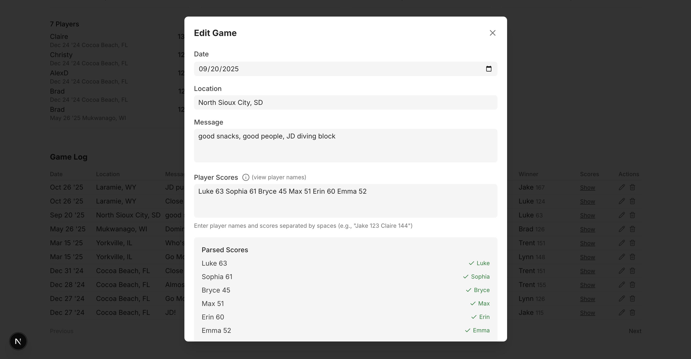
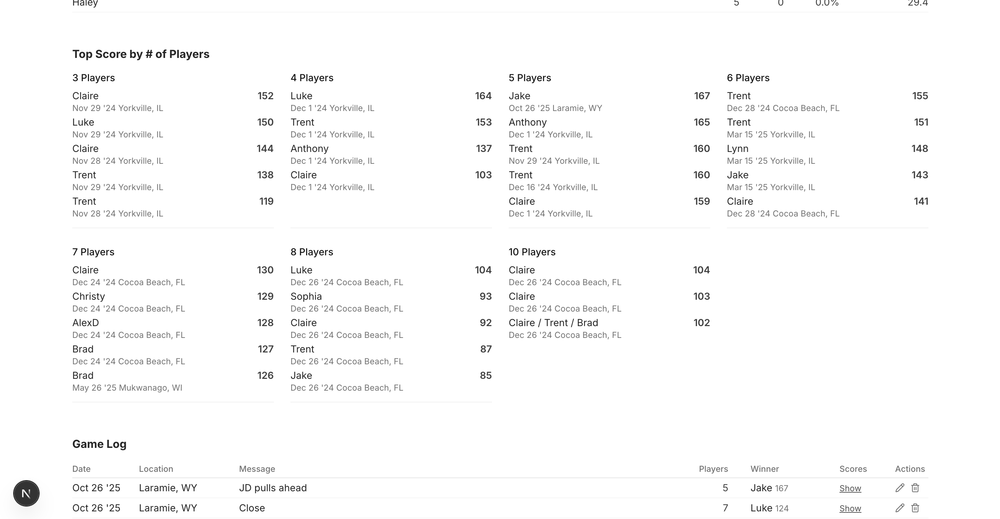
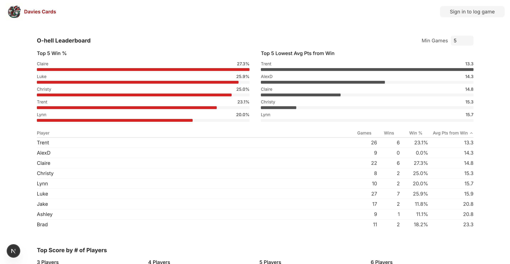
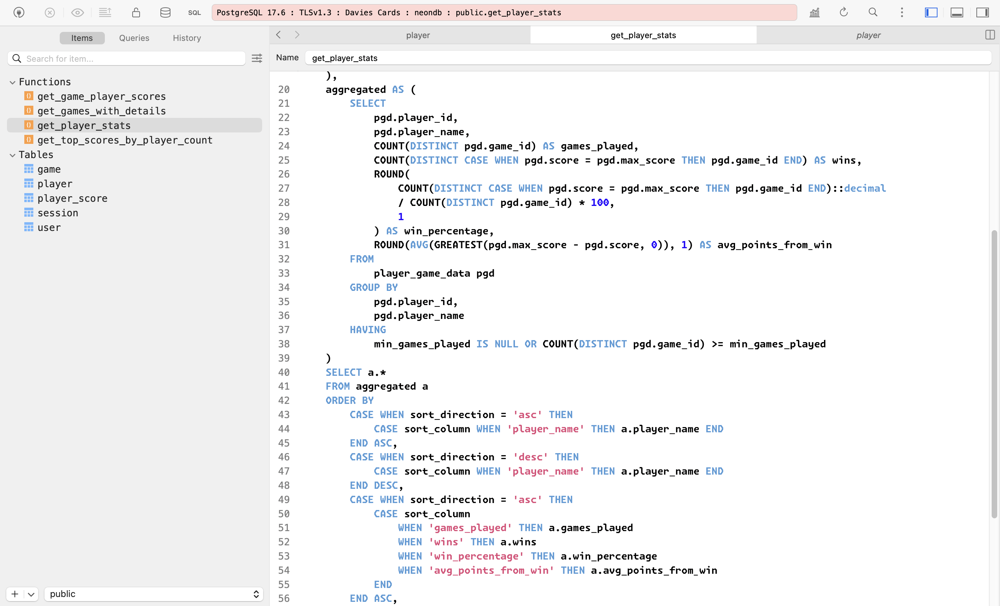

Davies Cards is a small full-stack app for a running leaderboard of O-Hell card games with family and friends. The point was to make something for logging games quickly on a phone, and viewing the leaderboard/high scores in one tap.

### Tech Stack

Next.js 16, React, TypeScript, Neon Postgres, Stored Procedures, Tailwind, Vercel

Live Site: https://daviesoh.vercel.app

### UI / SQL

