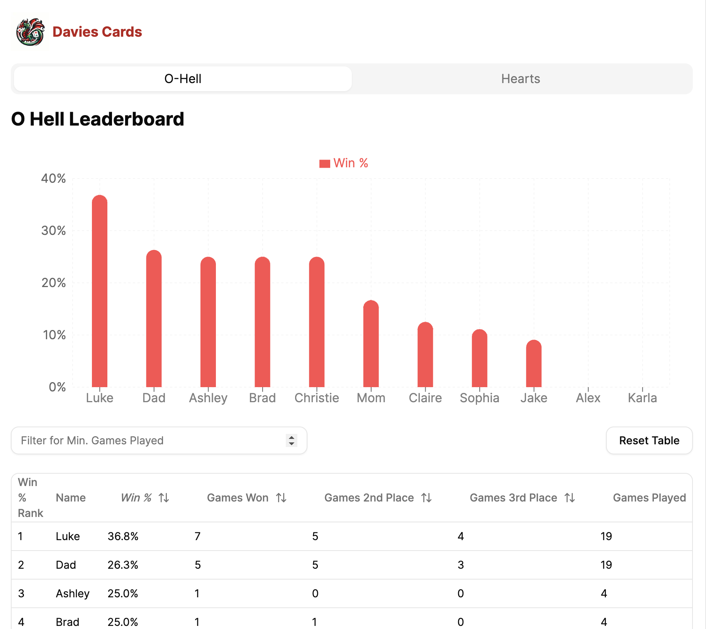

## Davies Cards

A full-stack CRUD app for a leaderboard of family card games over time.

An admin account can log new games, while the public facing dashboard shows the leaderboard.


### Stack
- Next.js
  - shadcn/ui
  - Lucia Auth
  - Prisma w Sqlite

## Development

This is a [Next.js](https://nextjs.org/) project bootstrapped with [`create-next-app`](https://github.com/vercel/next.js/tree/canary/packages/create-next-app).

### Getting Started

First, run the development server:

```bash
npm run dev
# or
yarn dev
# or
pnpm dev
# or
bun dev
```

Open [http://localhost:3000](http://localhost:3000) with your browser to see the result.

You can start editing the index page by modifying `app/page.tsx`. The page auto-updates as you edit the file.
