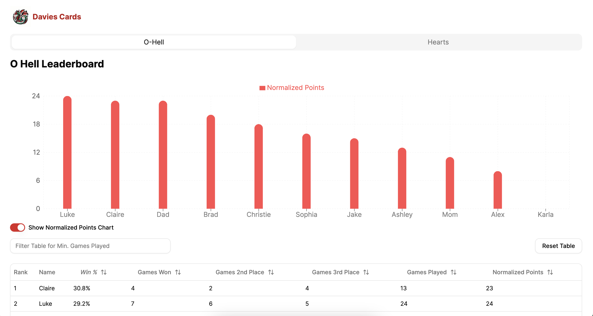
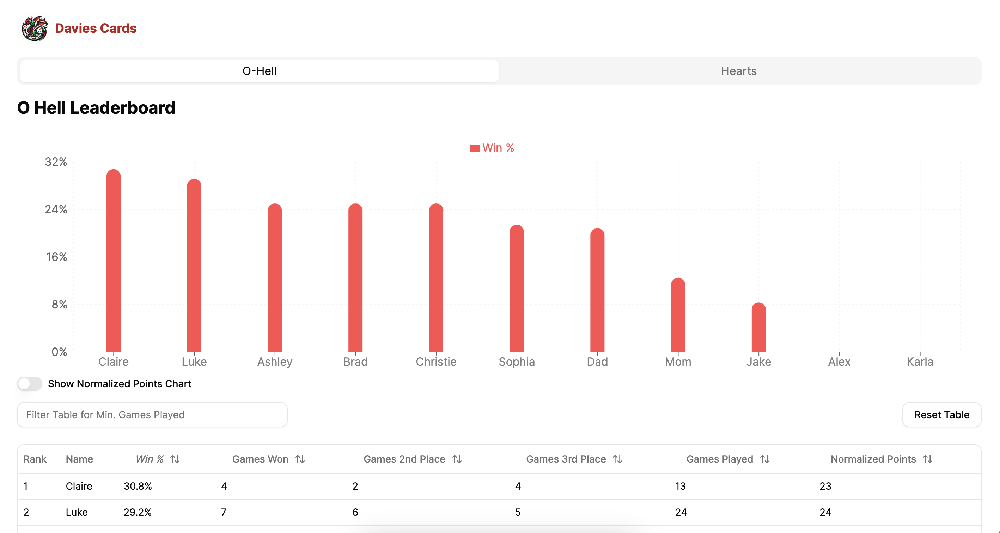
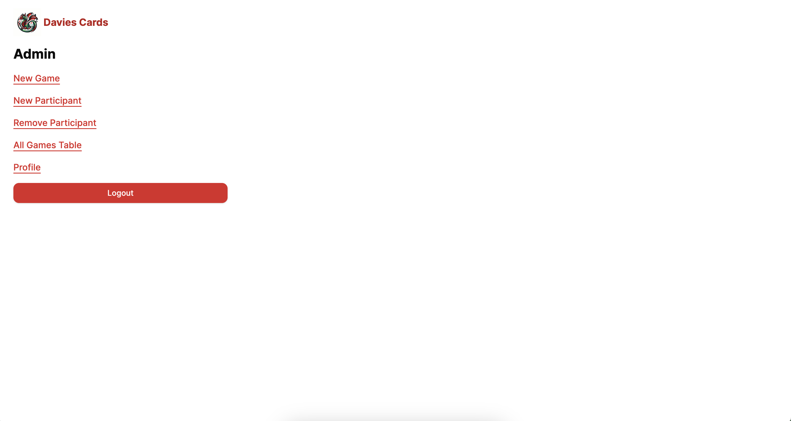
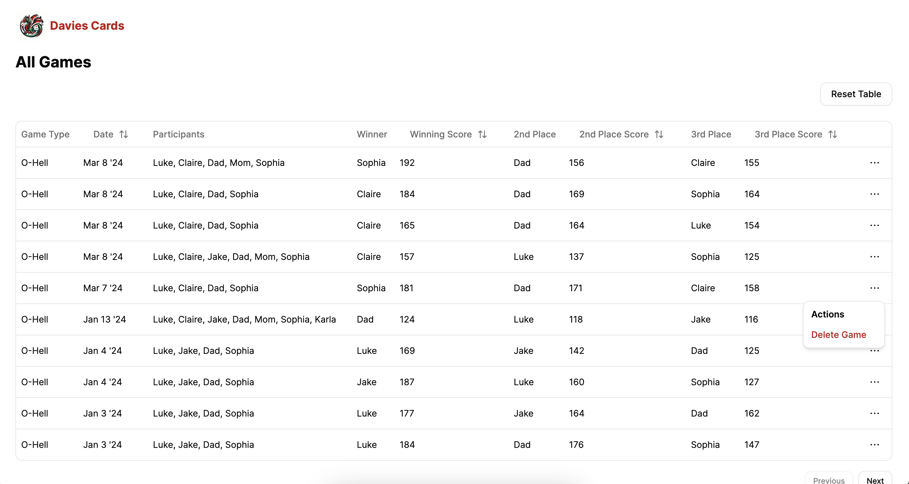
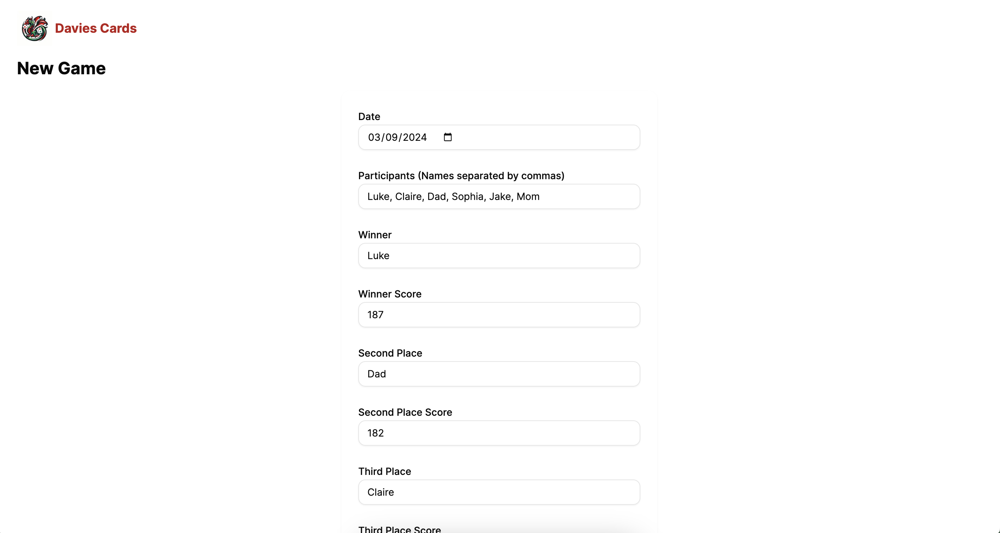

## Davies Cards

A full-stack CRUD app for a leaderboard of family card games over time.

An admin account can log new games, while the public facing dashboard shows the leaderboard.

Live at [daviescards.vercel.app](https://daviescards.vercel.app)

### Stack

- Next.js
  - Tailwind with shadcn/ui
  - Lucia Auth
  - Prisma w Turso

### More Images

